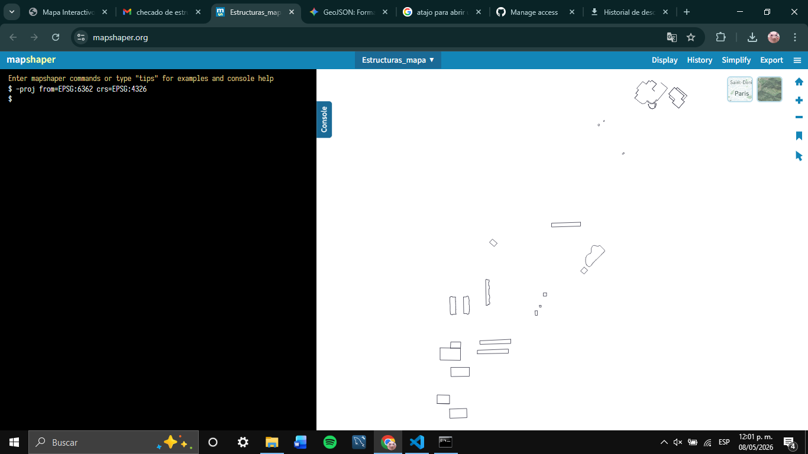
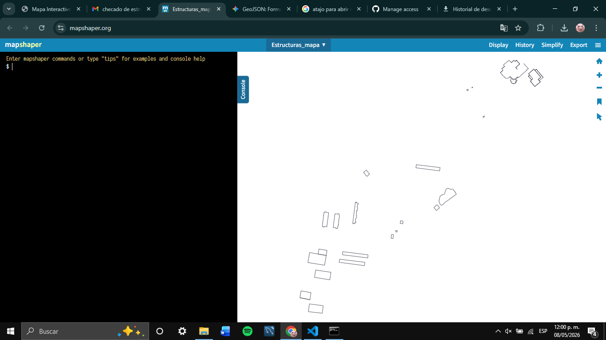
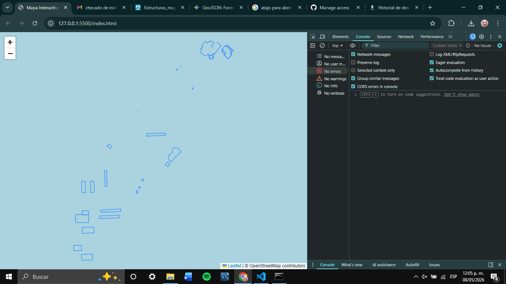
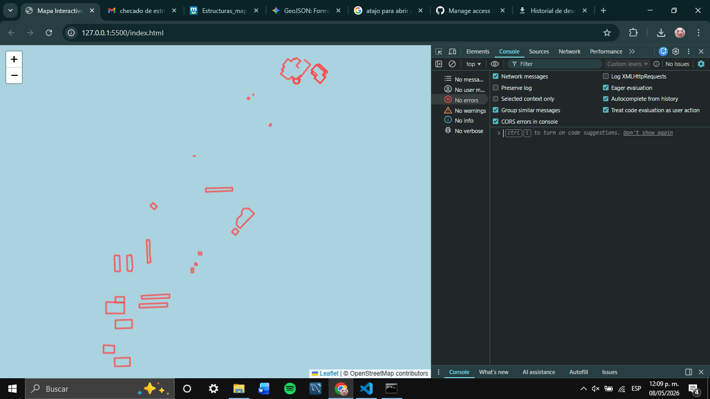
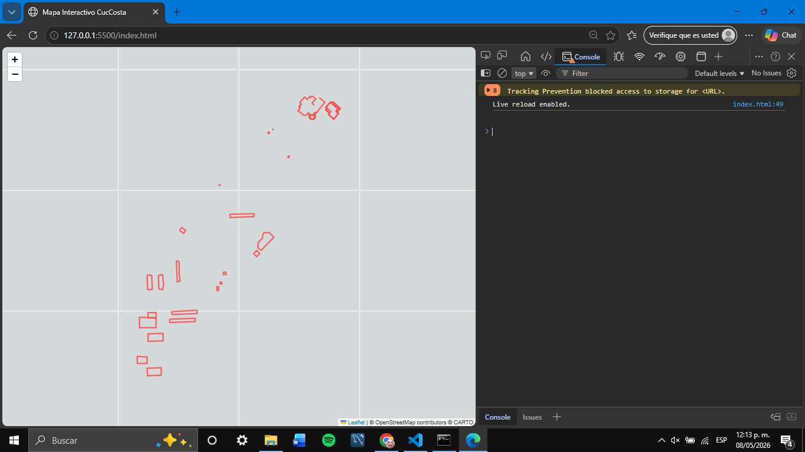

# pruebaGEOJson
Nomas para ver la visualizacion de un archivo .geojson gg

## Commit 12:28 - 08.05.2025
Supuestamente esto ya funciona debido a que se muestran los polígonos en el plano, solo que tuve que hacer algunas cosas:

#  Bitácora de cómo se arregló el mapa

Supuestamente esto ya funciona debido a que se muestran los polígonos en el plano, solo que tuve que hacer algunas cosas:

### 1. Convertir el mapa en la página Mapshaper
Se usó la página [Mapshaper](https://mapshaper.org/) para transformar el archivo. El problema principal era que los datos originales estaban en **metros** (un sistema llamado EPSG:6363), lo que hacía que no se pudieran leer como puntos geográficos reales.

Para arreglarlo, abrimos la consola de la página y usamos este comando:
`-proj from=EPSG:6363 crs=EPSG:4326`

Esto "proyectó" los edificios a coordenadas de latitud y longitud (el estándar que entiende cualquier mapa web).

*Aquí los números eran enormes porque estaban en metros.*

*Aquí ya aparecen como coordenadas reales (decimales).*

---

### 2. Inconvenientes con los navegadores (Chrome)
Al principio tuvimos problemas porque el mapa se veía en blanco o con pura "pantalla azul". Esto pasaba porque, aunque las coordenadas ya estaban bien, las estructuras estaban "flotando" en el Océano Pacífico (debido al punto de origen del plano original).

Para que no tuviéramos que buscar los edificios manualmente por todo el mundo, agregamos en el código JS la función `map.fitBounds()`. Esto hace que el mapa haga un zoom automático directo a los polígonos apenas carga la página.

*El mapa perdido en el océano.*

*Zoom automático directo a nuestras estructuras.*

---

### 3. Solución del fondo gris y capas (Navegador Edge)
En Edge el mapa de fondo de OpenStreetMap se ponía rebelde y no cargaba las imágenes (Tiles), dejando un fondo gris muy feo.

Para resolverlo, cambiamos el servidor del mapa base a **CartoDB Voyager**. Es una capa mucho más estable y ligera que no da problemas de carga entre navegadores. También ajustamos los Popups para que, al dar clic, nos muestre el ID y la capa de cada objeto.

*El error de carga antes de cambiar al servidor de CartoDB.*

---

### 🏁 Finalización
Al final, el proyecto quedó con un flujo sólido:
1. **Conversión:** De metros a grados con Mapshaper.
2. **Programación:** Carga asíncrona con `fetch` y auto-enfoque con `fitBounds`.
3. **Visualización:** Capas rojas para resaltar y fondo de mapa estable.
